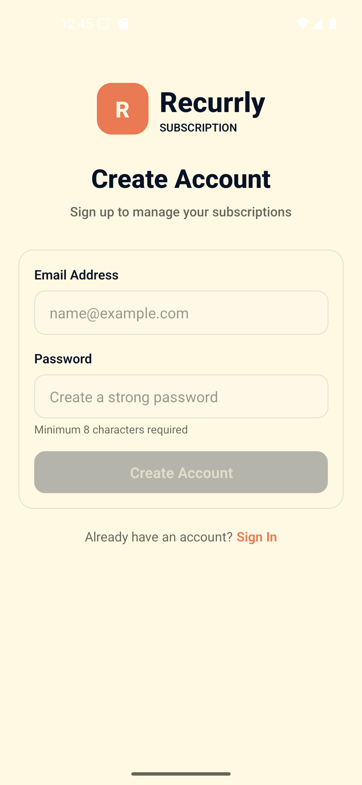
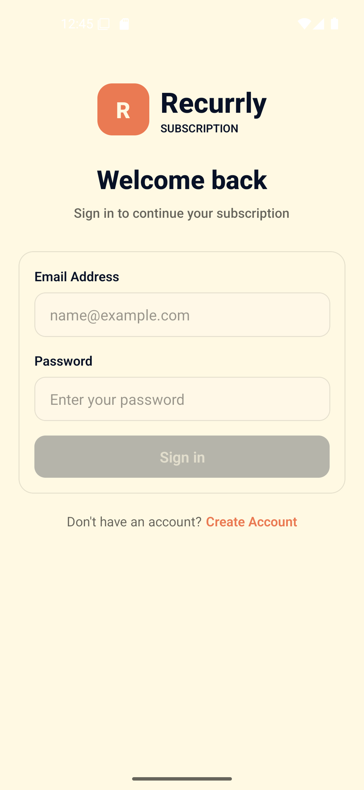
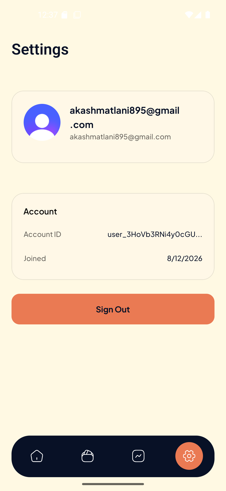
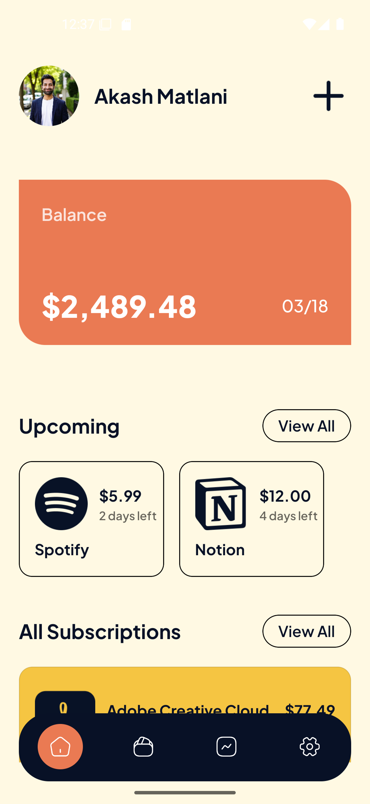
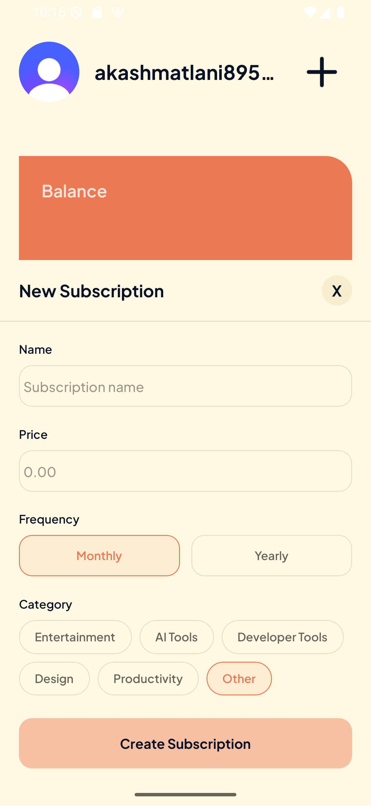
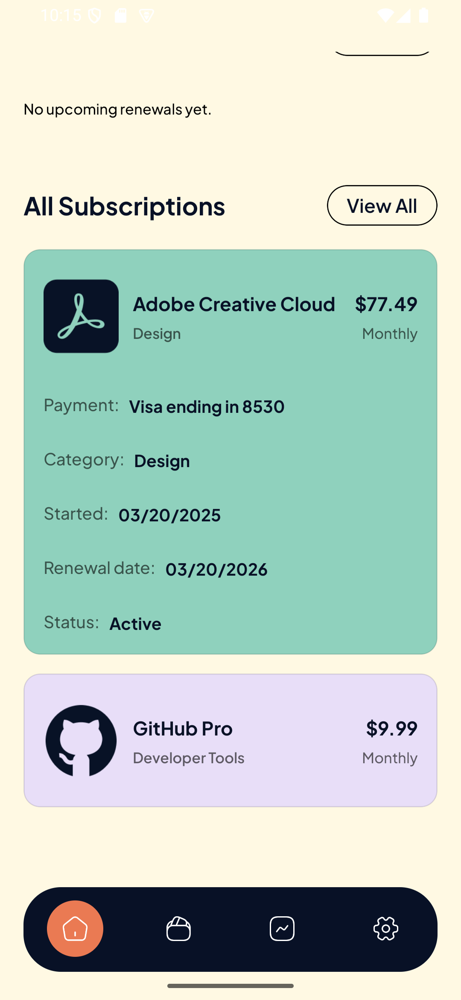
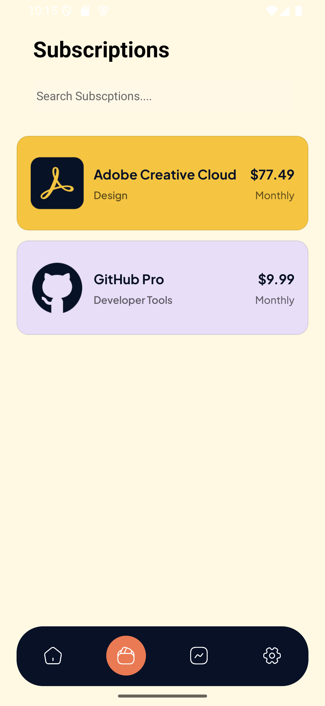
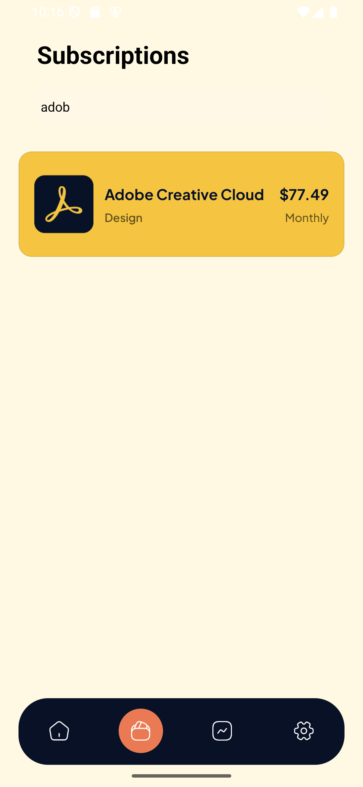
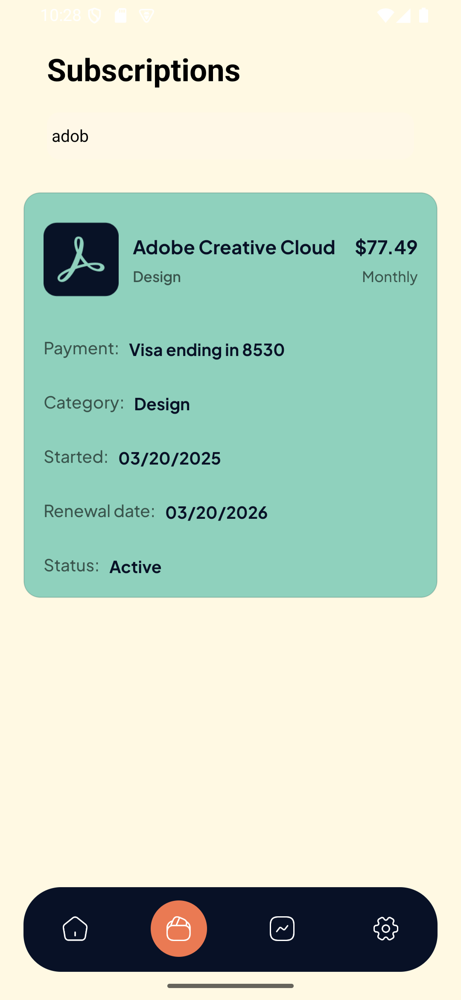

# 📱 Subscription Management — React Native App

A modern full-stack subscription management mobile application built with **React Native, Expo, TypeScript, NativeWind, and Node.js**.

The goal of this project is to help users manage recurring subscriptions in one place, track active and inactive services, and receive reminders before upcoming billing dates.

## 📸 Screenshots

<p align="center">
  
  
  
  
  
  
  
  
  
  
   
</p>

## ✨ Features

- 📊 **Subscription Dashboard** — View recurring expenses from a centralized dashboard.
- 🔄 **Active & Inactive Tracking** — Track which subscriptions are currently active and identify unused services.
- 🔐 **Secure Authentication** — User authentication and account management with Clerk.
- 🧭 **Native Navigation** — Smooth navigation designed for iOS and Android.
- 💳 **Monetization Ready** — Designed to support billing and payment workflows.
- 🧩 **Reusable Architecture** — Structured with reusable components and maintainable code patterns.

## 🛠️ Tech Stack

### Frontend & Mobile

- **React Native** — Cross-platform native mobile development.
- **Expo** — Development, routing, and build tooling for React Native.
- **TypeScript** — Type-safe application development.
- **NativeWind** — Utility-first styling with Tailwind CSS concepts.

### Backend & Database

- **Node.js** — JavaScript runtime for backend services.
- **Express.js** — Backend API and routing framework.
- **MongoDB** — Database for storing application data.

### Authentication, Analytics & Tools

- **Clerk** — Authentication and user management.
- **CodeRabbit** — AI-assisted code review.

## 📁 Project Goals

This project is being developed to provide a simple and reliable way for users to:

- Add and manage recurring subscriptions.
- Monitor monthly and recurring expenses.
- Separate active and inactive subscriptions.
- Receive reminders before billing dates.
- Keep subscription information organized in one application.
- Build a scalable full-stack mobile application architecture.

## 🚀 Getting Started

### Prerequisites

Make sure you have the following installed:

- [Git](https://git-scm.com/)
- [Node.js](https://nodejs.org/)
- npm
- Expo Go (optional, for testing on a physical device)

### 1. Clone the Repository

Clone the repository and move into the project directory:

```bash
git clone https://github.com/AkashMatlani/Monetize.git
cd Monetize
```

### 2. Install Dependencies

Install the project dependencies:

```bash
npm install
```

### 3. Configure Environment Variables

Create a `.env` file in the root directory:

```env
EXPO_PUBLIC_CLERK_PUBLISHABLE_KEY=
```

Add your Clerk publishable key after the `=`.

### 4. Start the Development Server

Start the Expo development server:

```bash
npm run dev
```

If your project uses the standard Expo command instead:

```bash
npx expo start
```

### Expo Shortcuts

Once the Expo development server is running, you can use:

| Key | Action                    |
| --- | ------------------------- |
| `a` | Open Android              |
| `i` | Open iOS Simulator        |
| `w` | Open Web                  |
| `r` | Reload the application    |
| `m` | Open the development menu |

You can also scan the QR code using **Expo Go** on your phone.

## 🧱 Architecture

The project follows a full-stack architecture:

```text
React Native / Expo
        │
        ▼
    Mobile UI
        │
        ▼
   Express API
        │
        ▼
     Node.js
        │
        ▼
     MongoDB
```
