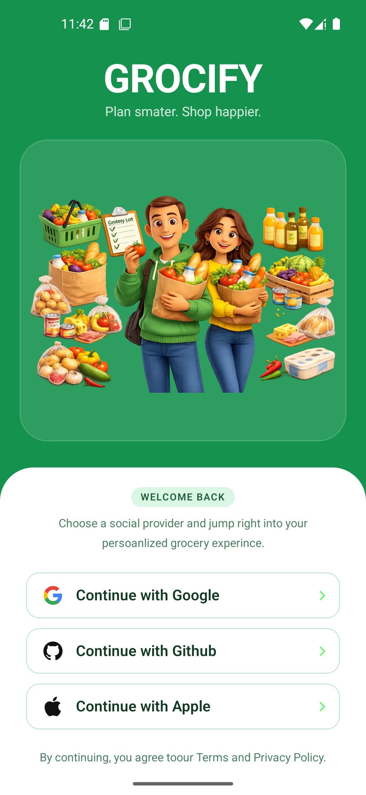

📱 Subscription Management — React Native App

A modern full-stack subscription management mobile application built with React Native, Expo, TypeScript, NativeWind, Node.js.

The goal of this project is to help users manage recurring subscriptions in one place, track active and inactive services, and receive reminders before upcoming billing dates.

## 📸 Screenshots

  
  
  

✨ Features

📊 Subscription Dashboard — View recurring expenses from a centralized dashboard.

🔄 Active & Inactive Tracking — Track which subscriptions are currently active and identify unused services.

🔐 Secure Authentication — User authentication and account management with Clerk.

🧭 Native Navigation — Smooth navigation designed for iOS and Android.

💳 Monetization Ready — Designed to support billing and payment workflows.

🧩 Reusable Architecture — Structured with reusable components and maintainable code patterns.

🛠️ Tech Stack

Frontend & Mobile

React Native — Cross-platform native mobile development.

Expo — Development, routing, and build tooling for React Native.

TypeScript — Type-safe application development.

NativeWind — Utility-first styling with Tailwind CSS concepts.

Backend & Database

Node.js — JavaScript runtime for backend services.

Express.js — Backend API and routing framework.

Authentication, Analytics & Tools

Clerk — Authentication and user management.

CodeRabbit — AI-assisted code review.

📁 Project Goals

This project is being developed to provide a simple and reliable way for users to:

Add and manage recurring subscriptions.

Monitor monthly and recurring expenses.

Separate active and inactive subscriptions.

Receive reminders before billing dates.

Keep subscription information organized in one application.

Build a scalable full-stack mobile application architecture.

🚀 Getting Started

Prerequisites

Make sure you have the following installed:

Git

Node.js

npm

Expo CLI / Expo development environment

Expo Go (optional, for testing on a physical device)

1. Clone the repository

git clone https://github.com/AkashMatlani/Monetize.git
cd Monetize
npm install

2. Install dependencies

npm install

3. Start the Expo development server

npx expo start

You can then use the following Expo shortcuts:

a — Open Android

i — Open iOS Simulator

w — Open Web

r — Reload

m — Open the development menu

You can also scan the QR code using Expo Go on your phone.

🔐 Environment Variables

Create a .env file in the root directory:

EXPO_PUBLIC_CLERK_PUBLISHABLE_KEY=

▶️ Running the Project

After configuring your environment variables, start the development server:

npm run dev

If your project uses the standard Expo command instead:

npx expo start

🧱 Architecture

The project follows a full-stack architecture:

React Native / Expo
│
▼
Mobile UI
│
▼
Express API
│
▼
Node.js
│
▼
MongoDB

Authentication is handled through Clerk, while PostHog is used for product analytics.

🗺️ Roadmap

Initial React Native / Expo setup

TypeScript configuration

Authentication integration

Subscription dashboard foundation

Complete subscription CRUD functionality

Expense analytics

Subscription categories

Payment/billing integration
